# Build a LAMP Stack in which the Database (MySQL) is on a separate server on a private subnet from the web server
Here is a map of what we are going to build in my case I used differnet ip addresses but it should be fine as long you two diffenret subnet public and privat. Don't wory i'm going t show you how you can do that:

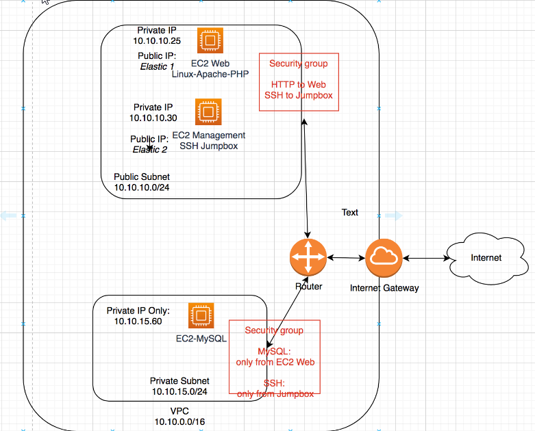

#### Steps:
IP addresses and EC2:

| Name              | IP Address |
|-------------------|------------|
| Jumpbox           | 10.10.1.27 |
| Linux-Apache-PHP  | 10.10.1.63 |
| MySQL             | 10.10.2.250|

The first thing you need to do is to create a a VPC for this project. To do that go to VPC → Your VPC → create VPC

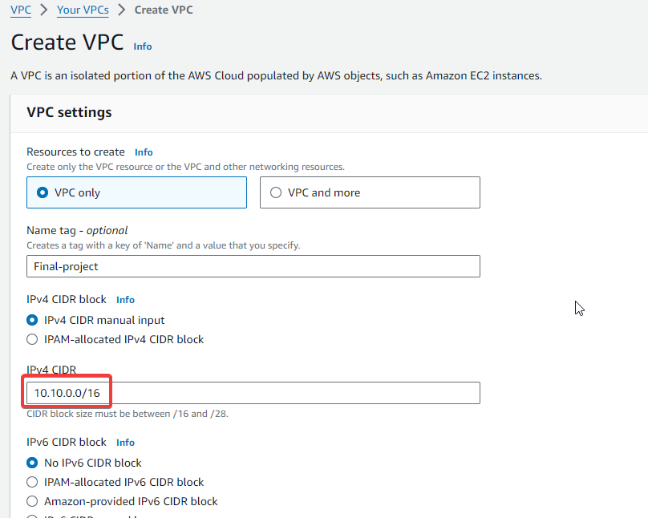

Now we are going to create two subnet public and private as shown below:

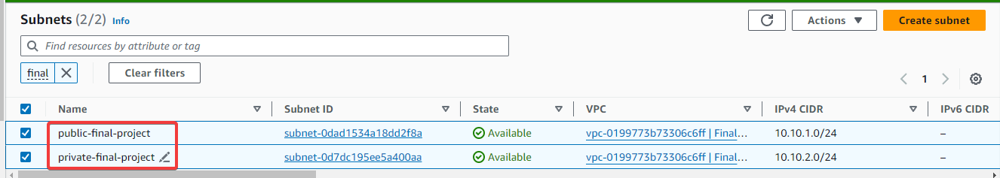

Next we are going to create a internet gatway, to do that go to VPC → Internet gatway → create internet gateway. In my case I called it ginal-IGW:

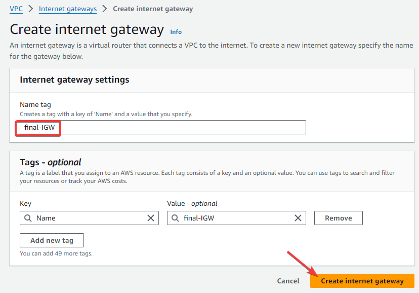

After that make suer it is Attach to a VPC, to do that, in the same page click on Actions → Attacj to VPC:

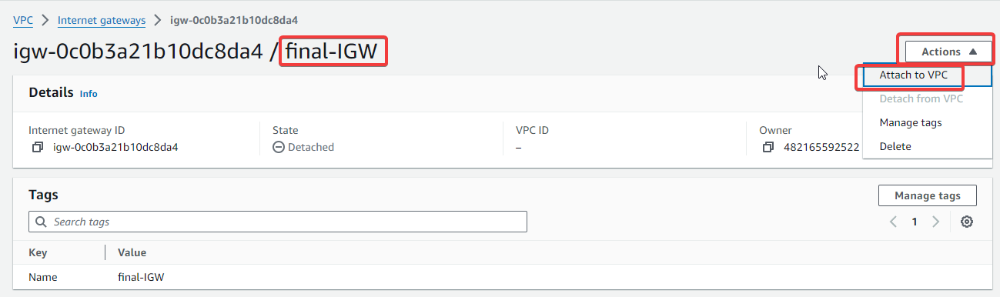

After you need to specfiy what VPC you want to Attach it to, in my case I will attack it to VPC that I created:

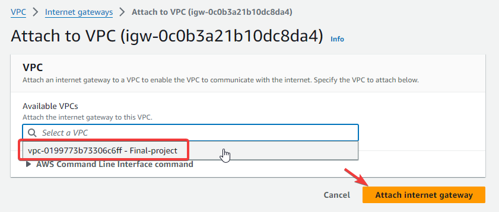

Now we need to create a route tables for the public and private. To do that go VPC → Route tables → Create route table:
Here it is for the public:
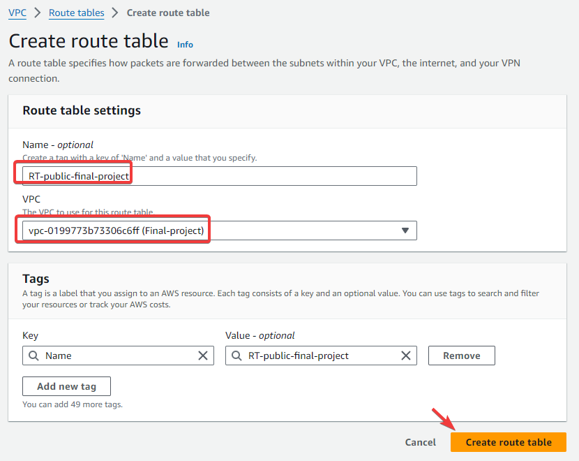

Now do the same with private:

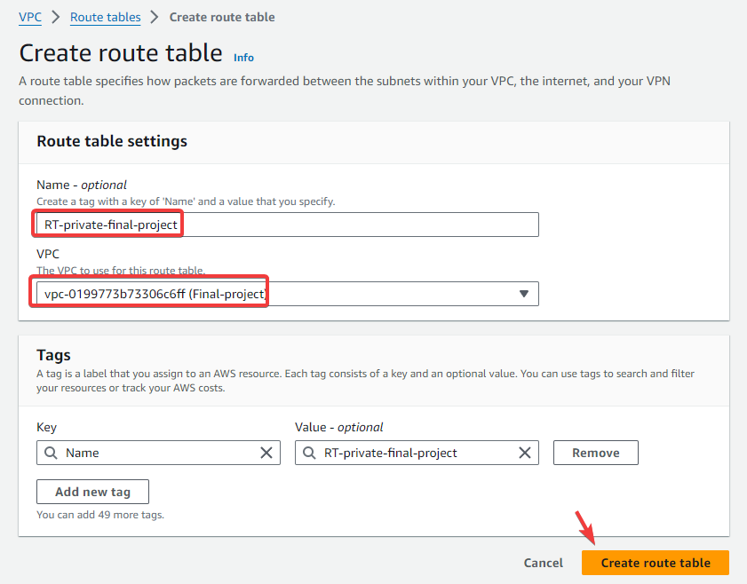

Now we need to associate a subnet to the public and private subnets. Let's start with public. select the public rout table → click on Subnet associations → Click on Edit subnet associations:

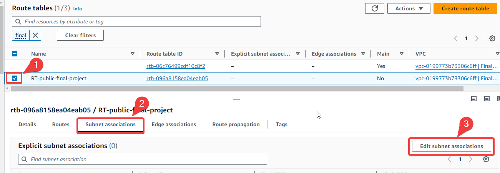

The above will take you to this page now select your subnet in this case the public:

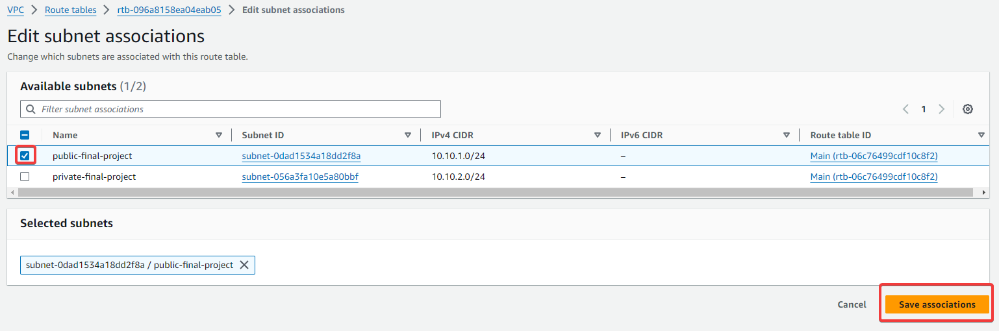

Now do the same with private route table: select private → subnet associations → Edit subnet associations:

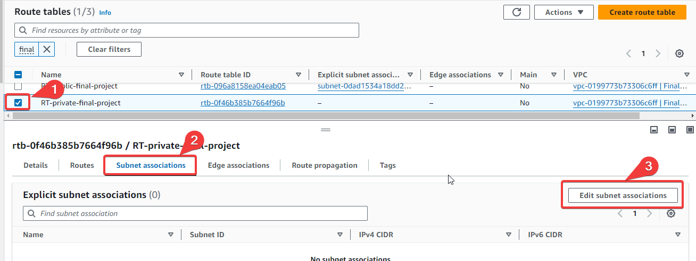

in this case select privat subnet and click on save:

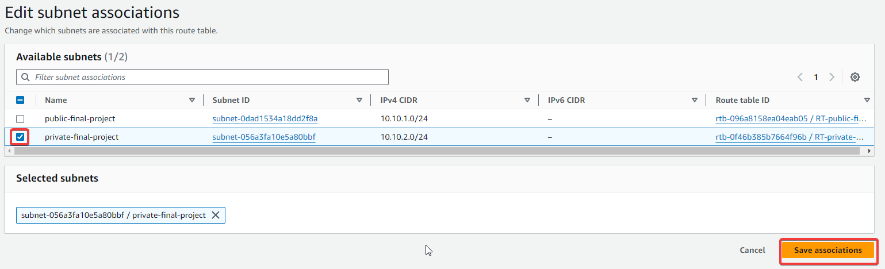

Now we need to edit the route for public route table to access the internet (for the private route table we need to create NAT): to do that select the public RT → click on Routes → Edit routes:

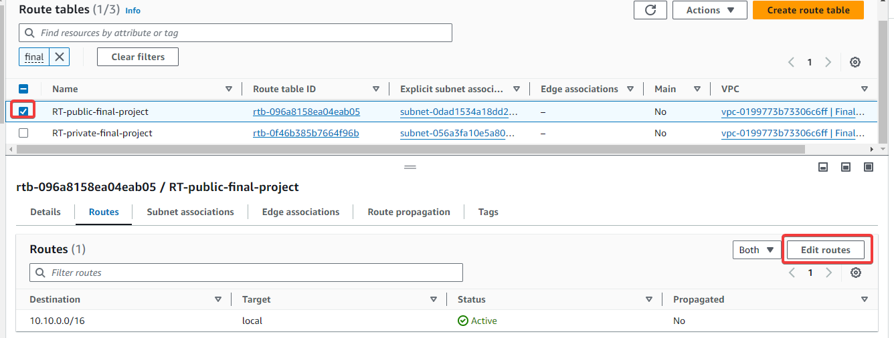

After that click on Add route → for Destionation choose 0.0.0.0/0, Target choose Internet Gateway and under it choose your igw that you created above:

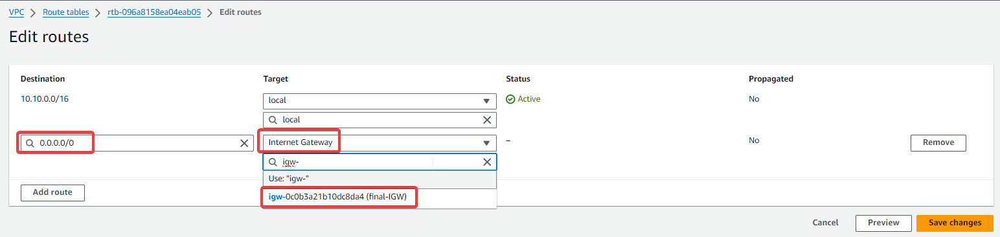

Now we need to do some work for the Private route table becouse this should private and secure. To do that create a NAT gateway as shown below:

**!NOTE:** make suer for thesubnet chose the right one in my case the public:

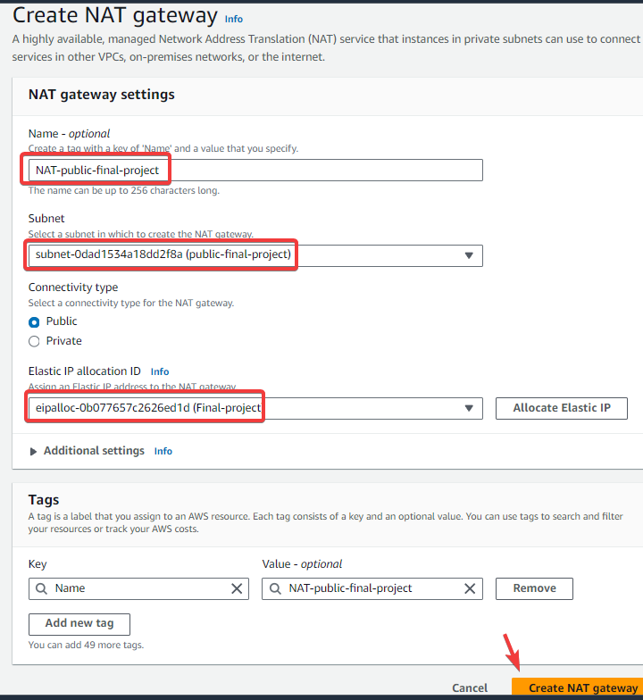

After that go back to the route tables and select the private RT → Routes → Edit routes:

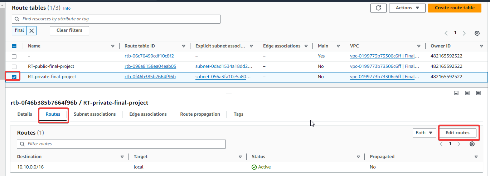

Click on Add route, for Destionation choose 0.0.0.0/0 → for Target choose NAT Gateway → select the NAT that you created abvoe:

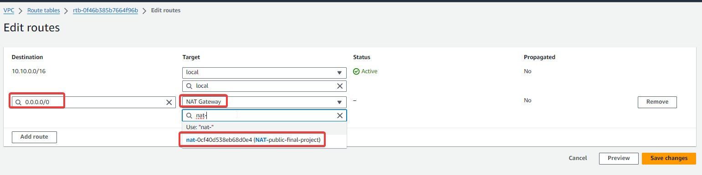

Allocate a new IP from Elastic IP address:

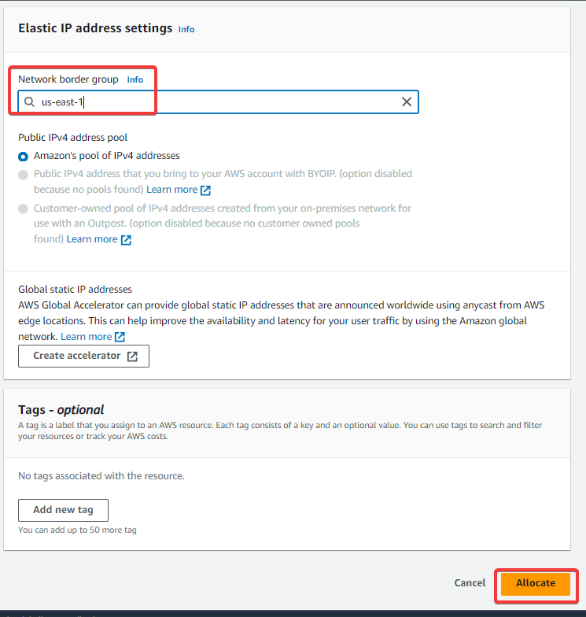

Here is the Elastic IP address:

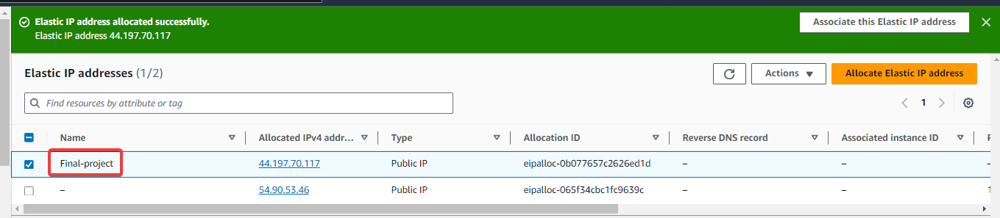

Almost done, we need to create a security groups for this projects. I added HTTPs but not reqired:

*   **Public Subnet**
    *   HTTP allowed from Internet only to EC2-Web
    *   SSH allowed from Internet only to EC2-Jumpbox
      
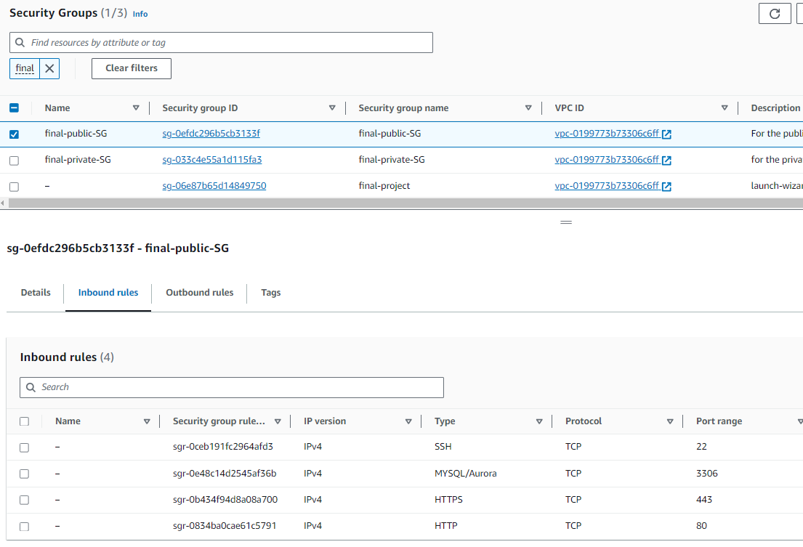

*   **Private Subnet**
    *   SSH only allowed from EC2-Jumpbox to EC2-MySQL
 
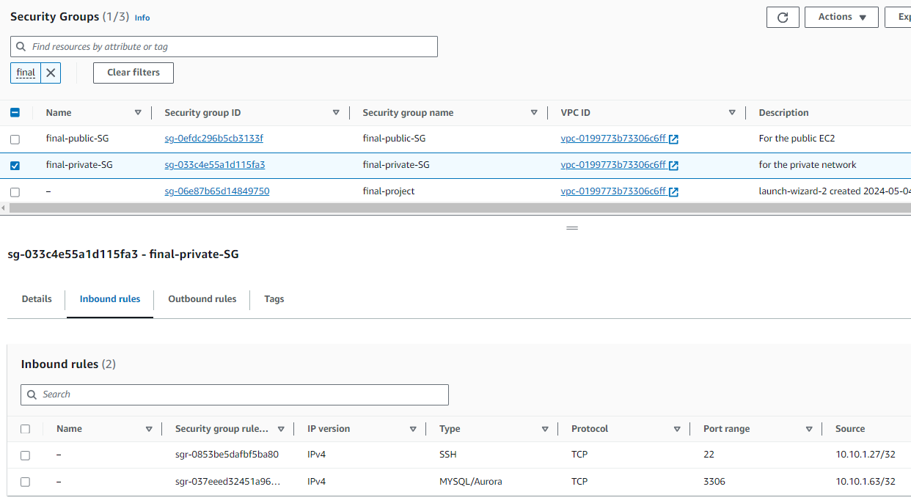

##### Launching Instances (ubuntu)
As you can see below we are going to create three EC2 instances for this project: 
1. Linux-Apache-php: This is the web server
2. jumpbox: used to ssh and testing
4. MySQL: this is the database for the web server

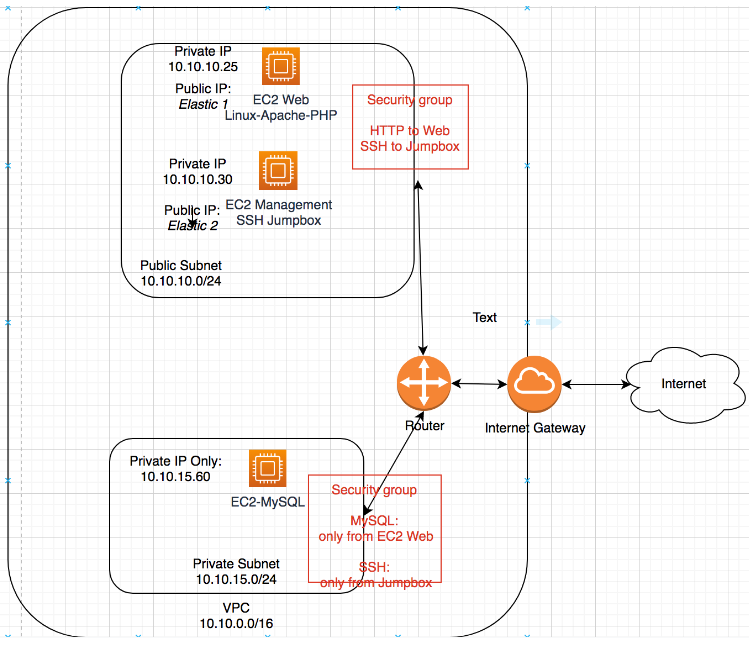

Name make suer you pick **ubuntu** I pick amazon linux and i had to redo:

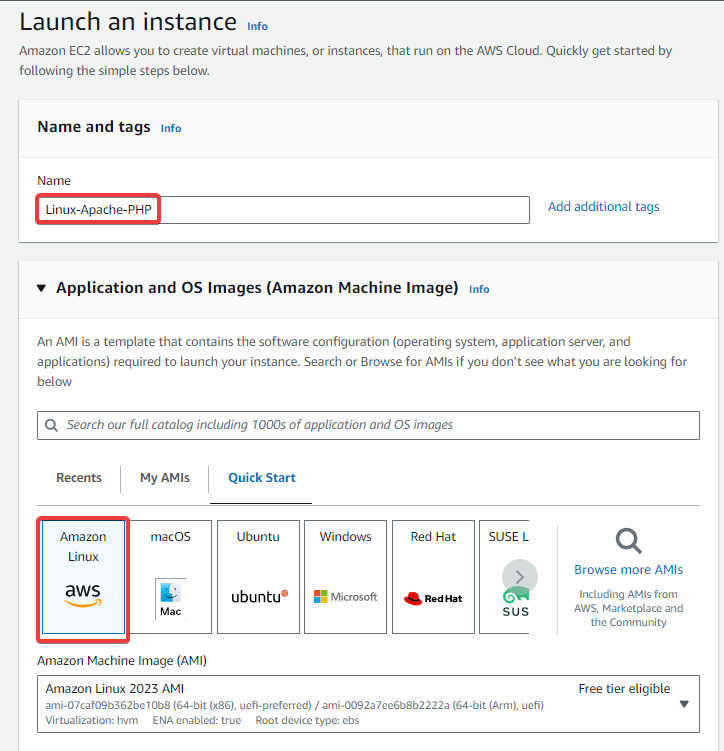

Pick you key pair if you don't have one click on create new kay pair. pick your VPC that was created for this project, and make suer it it on the public subnet. pick the security group that you created above for the public EC2, don't create new one we alreay did:

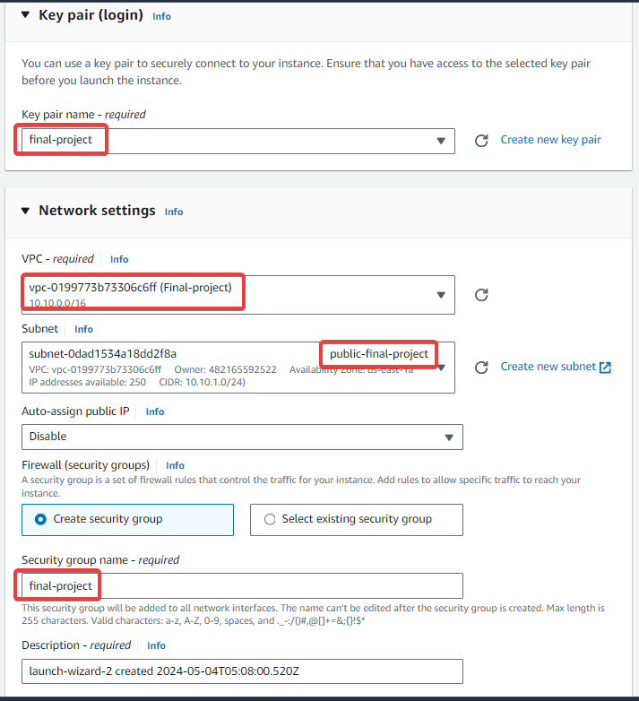

repeat it two more time for the MySQl and jumpbox. MysQL should be in the private subnet so do that when you pick the VPC:

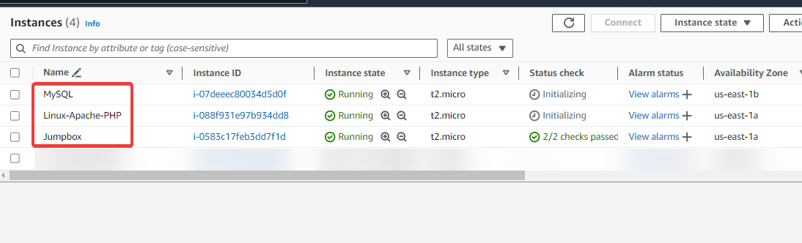

#### Building the web site
SSH to databse to install mysql server, run the following commands to uppdate the system and install mysql server:
```
apt-get update | apt-get install mysql-server
```

Now we need to setup the mysql for the web server to connect to it for that run the following commands:
```
# to log in to the mysql 
sudo mysql -u root -p

# below will create the database and called it wordpress
CREATE DATABASE wordpress;

# Here I'm adding a user and set a passowrd 
CREATE USER final@10.10.2.250 IDENTIFIED BY 'insert password here';

giving the user "final" all of the privileges on the wordpress database
GRANT ALL PRIVILEGES ON wordpress.* TO final@10.10.2.250
FLUSH PRIVILEGES;
EXIT

```

Now jump to the webserver, in the webserver we need to update the system and installed a lot of the reqired. These commands does the following:
I updated the package lists with `sudo apt-get update` to make sure I had the latest information on available packages. Following this, I installed Apache2, PHP, and necessary PHP extensions such as `php-gd` and `php-mysqlnd` to meet the prerequisites for running WordPress. I also installed the `mariadb-client` for database management. After the installations, I enabled and started the Apache2 service to ensure it would run automatically upon boot and be active immediately. I then proceeded to download the latest WordPress package, extracted its contents, and synchronized it with the root directory of my web server. To finalize the setup, I configured directory permissions and prepared the WordPress configuration file, ensuring everything was set for a smooth operation of a WordPress site.
```
sudo apt-get update
sudo apt-get install apache2
sudo apt-get install php
sudo apt-get install php-gd
sudo apt-get install php-mysqlnd
sudo apt-get install mariadb-client
sudo systemctl enable apache2
sudo systemctl start apache2

wget http://wordpress.org/latest.tar.gz
tar xzvf latest.tar.gz
sudo rsync -avP ~/wordpress/ /var/www/html/
sudo mkdir /var/www/html/wp-content/uploads
sudo chown -R www-data:www-data /var/www/html/*
cd /var/www/html
cp wp-config-sample.php wp-config.php


```
Make sure you edit wp-config.php to add your own credentials form the mysql server in that way the webserver will be able to connect to the mysql server.
```
sudo nano /var/www/html/wp-config.php
sudo systemctl start apache2
```


After restarting the apache server and go to the public IP of the web server you should be able see this:

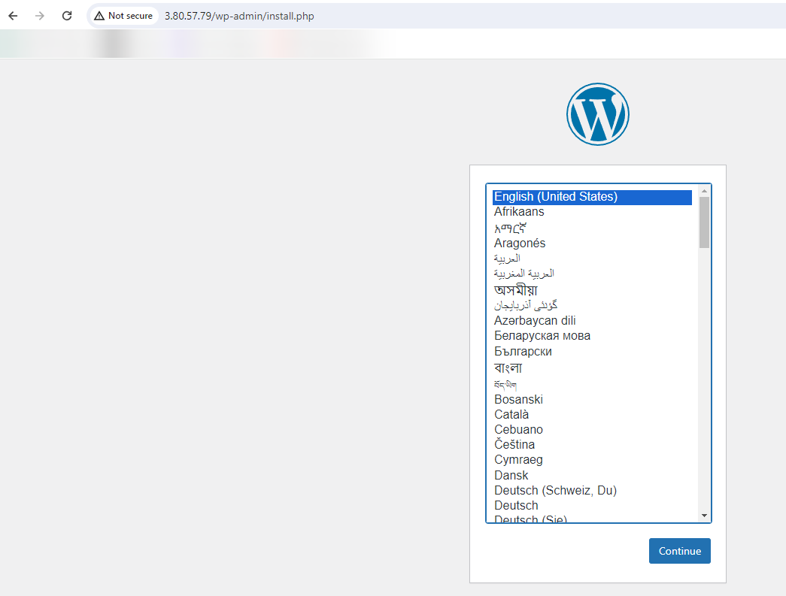
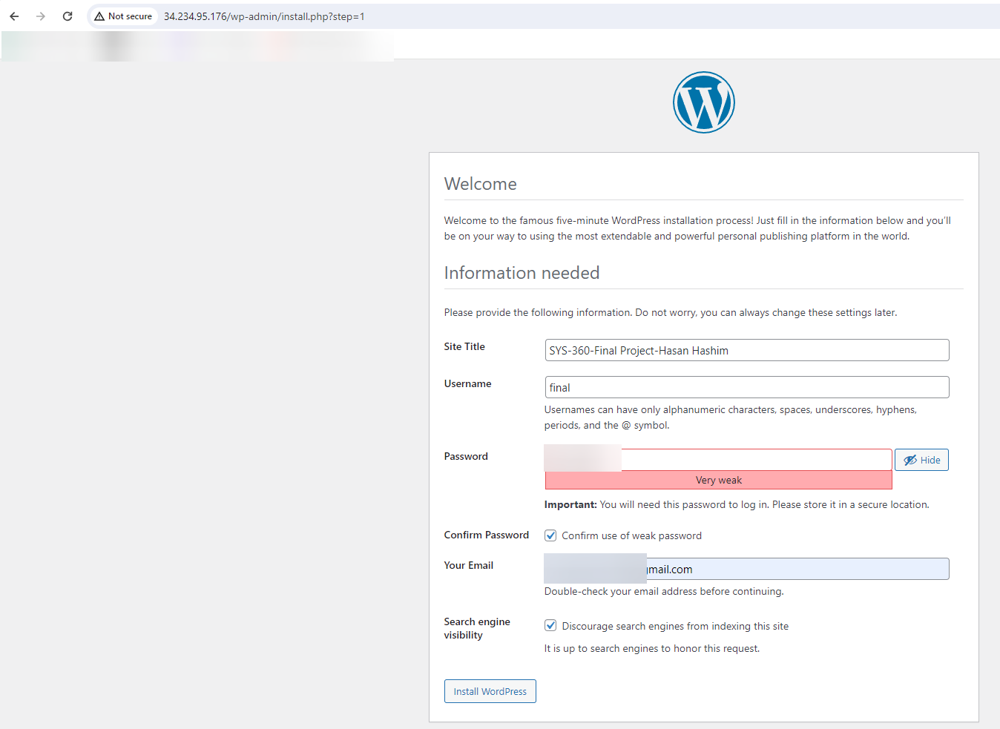
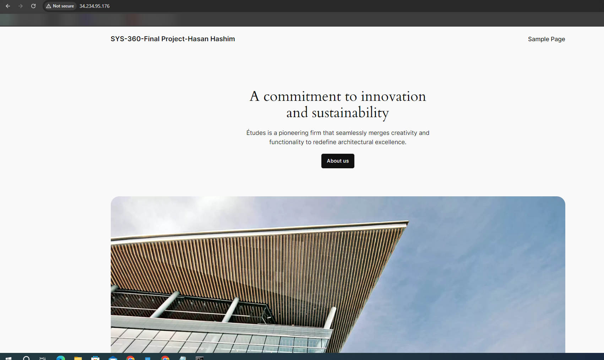