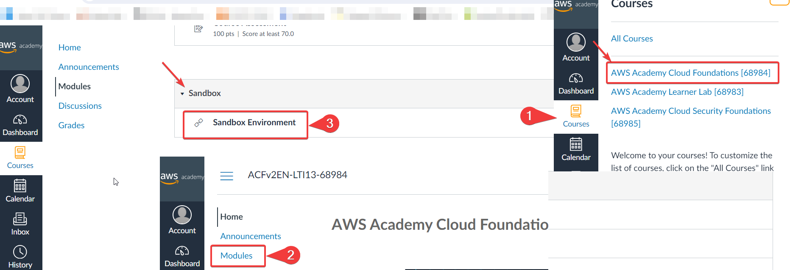
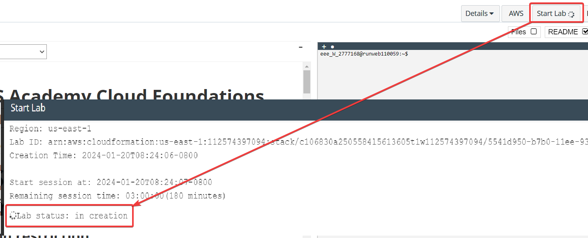
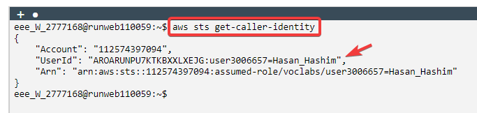
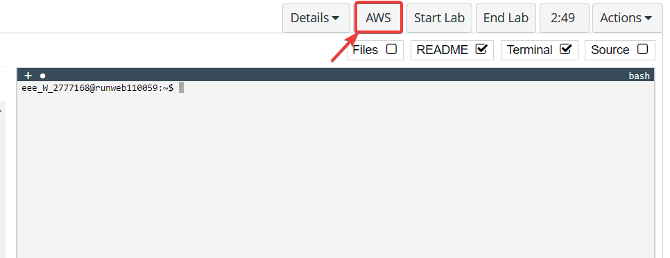
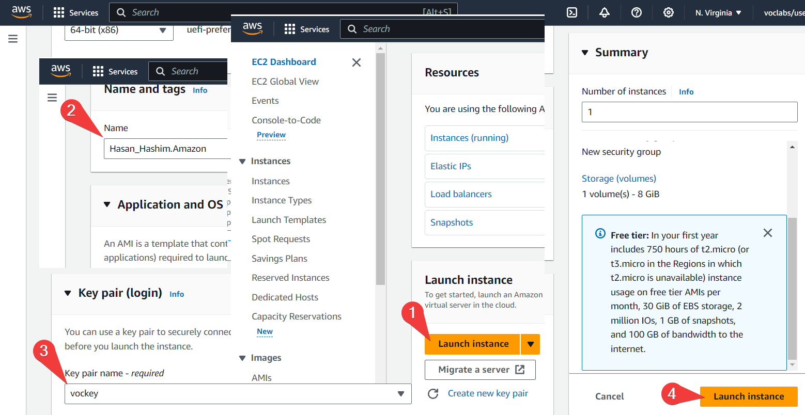
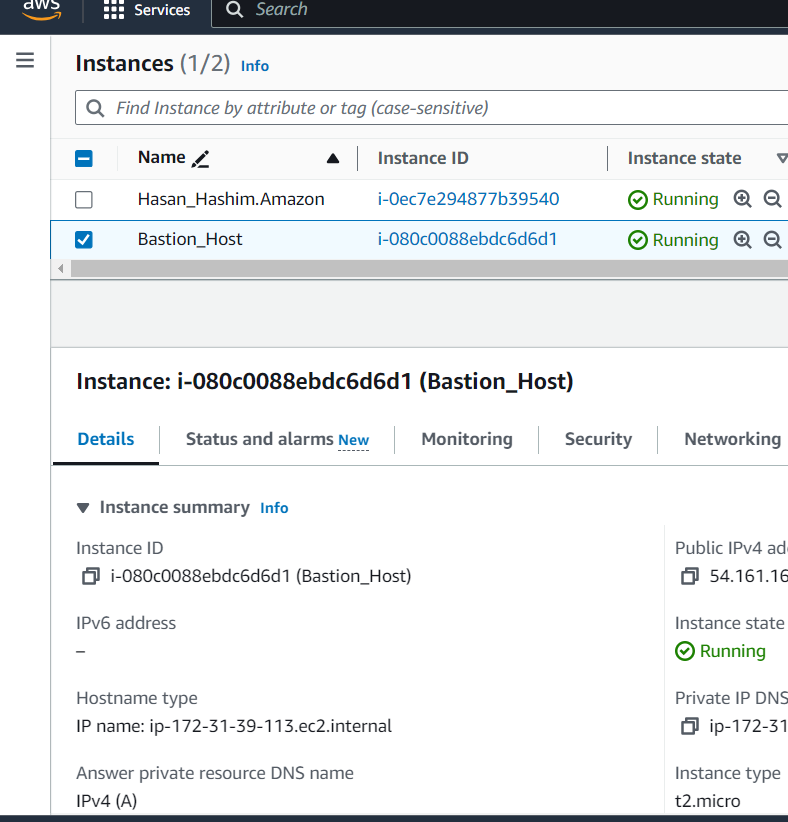
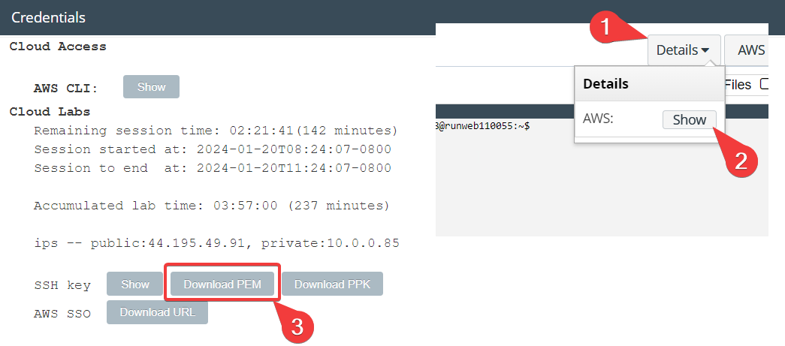
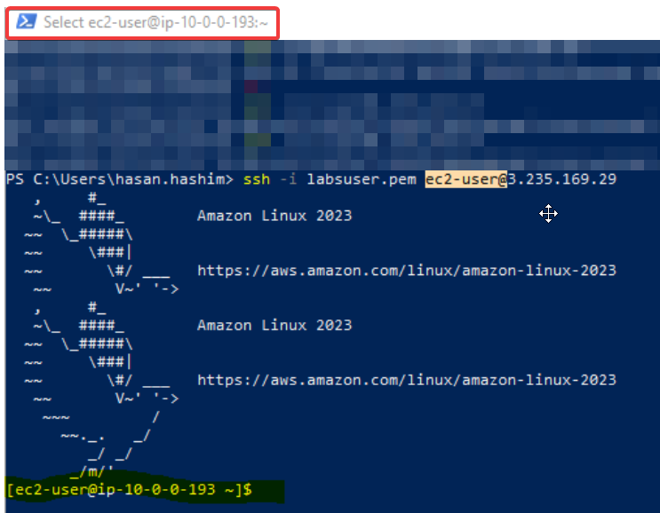

<!--StartFragment-->

**Goals for this lab:**

*   Configure your account on the AWS Canvas site
*   Use the AWS Academy Terminal
*   Use the AWS Academy Console
*   Launch an EC2 Instance
*   Use SSH to access EC2 Instance
  
<!--StartFragment-->
First we need to navgate to navigated through the "**AWS Academy Cloud Foundations**" by going to the "**Modules**" and clicking on the "**Sandbox Environment**", As it shown below:
<!--EndFragment-->

<!--StartFragment-->
Within the sandbox, we need to start the lab by clicking on "**Start Lab**,"
<!--EndFragment-->

<!--StartFragment-->
Output of " aws sts get-caller-identity" from AWS terminal (command prompt within lab)
<!--EndFragment-->

<!--StartFragment-->
Now we need to check the state of instance and make suer it is running, we need to follow the following steps as shown in the screenshots below:
<!--EndFragment-->

##SSH access through powershell
<!--StartFragment-->
In order to ssh to it we need a .pem file, to get the .pem file we need to do the following:
In the lab page go to "**Details**" > "**AWS**" > "**Show**":
<!--EndFragment-->

As we see below we are able to ssh to it using the following .pem file and the following commadn `ssh -i labsuser.pem ec2-user@3.235.169.29`

